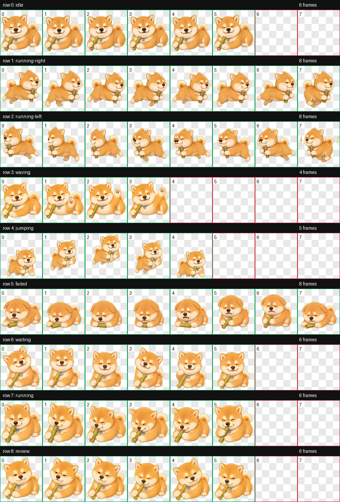

# PetHatch

**开放的桌面宠物包市场。**

[English](README.md)

PetHatch 收集可运行的 animated pet packs。它可以被 Codex-compatible runtime、OpenPets、agent status app、Kaji 等消费，但不绑定任何单一产品。

Gallery: <https://misterbrookt.github.io/pethatch/>

```bash
./bin/pethatch install xiaochai --force
```

<p align="center">
  
</p>

## 本地使用

查看宠物：

```bash
./bin/pethatch list
```

安装小柴：

```bash
./bin/pethatch install xiaochai --force
```

这会把 `pet.json` 和 `spritesheet.webp` 写入 `~/.codex/pets/xiaochai/`。

在 macOS 上运行小柴：

```bash
./bin/pethatch run xiaochai
```

快速体验压缩版行为：

```bash
./bin/pethatch run xiaochai --demo
```

Demo 模式会把真实分钟压缩成几秒，让你快速看到小柴从 focus 到 60 分钟休息提醒。

runner 由 `pets/xiaochai/runtime.json` 配置。小柴默认只有两个节点：`focus` 和 `60m rest`。当前 activity source 是键鼠活跃；15 分钟无输入后暂停/重置工作 session；触发休息提醒后，10 分钟无输入视为休息完成。默认是小尺寸和慢动画，避免挡住桌面。

```bash
./bin/pethatch run xiaochai --size medium
./bin/pethatch run xiaochai --rest-after 900 --rest-duration 600
./bin/pethatch run xiaochai --config path/to/runtime.json
```

`~/.codex/pets/<id>` 是 Codex Pets 和 OpenPets-compatible runtime 共用的本地约定。其它 runtime 可以读取同一目录，或从本仓库导入宠物包。

## 宠物包

每个宠物是一个目录：

```text
pets/xiaochai/
  pet.json
  spritesheet.webp
  contact-sheet.png
  preview.gif
```

核心格式是 8 列、9 行的 atlas，每格 `192x208`。推荐 atlas 尺寸是 `1536x1872`，因为 `8 * 192 = 1536`，`9 * 208 = 1872`。

必须动画：

`idle`, `running-right`, `running-left`, `waving`, `jumping`, `failed`, `waiting`, `running`, `review`。

见 [docs/protocol.md](docs/protocol.md)。

## 事件映射

token 快用完、quota 压力、长时间工作、提醒休息，不需要新增图片行；这些通过 `pet.json` 的 `events` 映射到已有动画：

- `quota.pressure` -> `review`
- `quota.limit` -> `waiting`
- `session.long` -> `review`
- `session.rest_suggested` -> `waiting`

## 校验

```bash
./bin/pethatch validate
```

## 贡献

见 [CONTRIBUTING.md](CONTRIBUTING.md)。宠物资产必须可分享，并声明资产 license。

## License

代码和文档是 MIT。宠物资产归贡献者所有，按各自 `pet.json` 声明的 license 分发；见 [LICENSE-PETS.md](LICENSE-PETS.md)。
